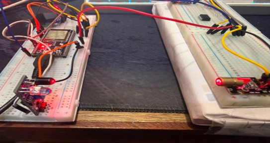
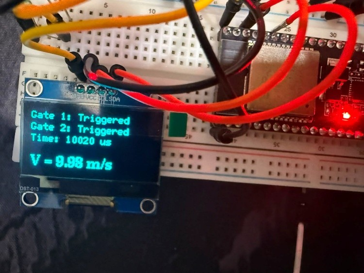
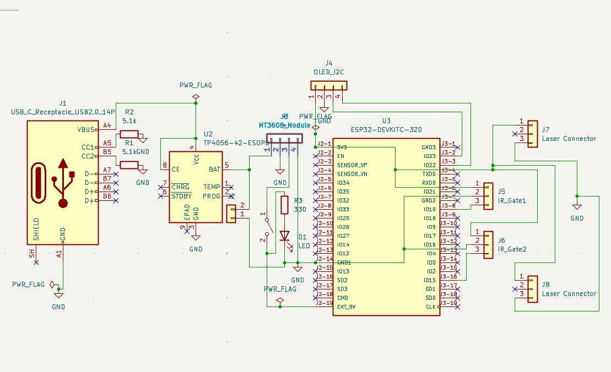
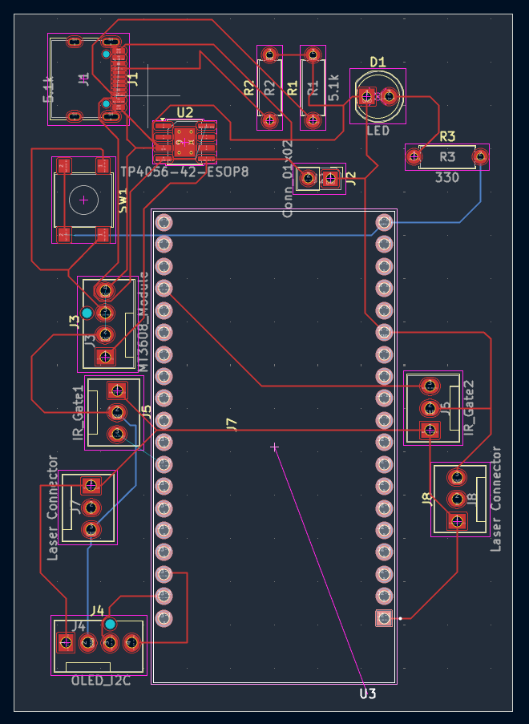
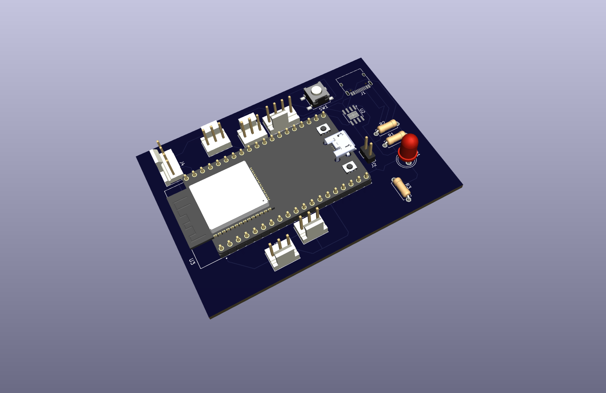

# Projectile Velocity Measurement System (PVMS)

> **Development of an IoT-Based Projectile Velocity Measurement System**


---

# 📖 Overview

The **Projectile Velocity Measurement System (PVMS)** is an embedded system designed to accurately measure projectile velocity using the **Optical Time-of-Flight (ToF)** principle.

The system employs two optical sensing gates connected to an **ESP32** microcontroller. As a projectile passes through the sensing gates, the ESP32 records the elapsed time with microsecond precision and calculates the projectile's velocity.

The measured velocity is displayed in real time on an OLED display and simultaneously transmitted through the Serial Monitor for debugging and data logging.

To improve hardware integration and reliability, a **custom PCB was designed using KiCad**, incorporating interfaces for the ESP32, OLED display, optical sensors, laser modules, and power connections.

This project was developed as part of a **summer internship at DRDO**. This repository contains only my original implementation, documentation, and hardware design intended for educational and portfolio purposes. No confidential or restricted information has been included.

---

# 📷 Project Preview

## Hardware Prototype



## OLED Display



## PCB Schematic



## PCB Layout



## PCB 3D Model



---

# ✨ Features

- High-speed projectile velocity measurement
- Optical Time-of-Flight sensing
- ESP32-based embedded system
- Microsecond precision using hardware interrupts
- Real-time OLED display
- Serial Monitor output
- Automatic timeout handling
- Low-cost implementation
- Custom KiCad PCB
- Compact and portable design

---

# ⚙ Hardware Used

| Component | Quantity |
|------------|----------|
| ESP32 DevKit V1 | 1 |
| SSD1306 OLED Display (128×64) | 1 |
| Laser Modules | 2 |
| Photodiodes | 2 |
| Breadboard | 1 |
| Jumper Wires | As Required |
| USB Power Supply | 1 |

---

# 🛠 Software Used

- Arduino IDE
- ESP32 Board Package
- KiCad
- Adafruit SSD1306 Library
- Adafruit GFX Library
- Wire Library

---

# 💻 PCB Design

A custom PCB was designed using **KiCad** to simplify wiring, improve reliability, and provide a compact hardware platform.

### PCB Features

- ESP32 interface
- OLED display connector
- Optical sensor connectors
- Laser module connectors
- Power input connector
- Compact PCB layout
- 3D STEP model included

---

# 🚀 Working Principle

The system consists of two optical sensing gates placed at a fixed distance.

1. The first optical gate detects the projectile.
2. ESP32 starts a high-resolution timer using hardware interrupts.
3. The second optical gate detects the projectile.
4. ESP32 stops the timer.
5. Velocity is calculated using the Time-of-Flight equation.

\[
Velocity = \frac{Distance}{Time}
\]

The calculated velocity is displayed on the OLED screen and transmitted through the Serial Monitor.

---

# 📋 Technical Specifications

| Parameter | Value |
|-----------|-------|
| Controller | ESP32 DevKit V1 |
| Measurement Method | Optical Time-of-Flight |
| Timing Resolution | Microseconds |
| Display | SSD1306 OLED |
| PCB Software | KiCad |
| Firmware | Arduino C++ |

---

# 🧰 Skills Demonstrated

- Embedded Systems
- ESP32 Programming
- Arduino C++
- PCB Design (KiCad)
- Optical Sensor Interfacing
- Hardware Interrupt Programming
- Time-of-Flight Measurement
- Electronic Circuit Design
- Technical Documentation

---

# 📂 Repository Structure

```text
Projectile-Velocity-Measurement-System/
│
├── README.md
├── LICENSE
├── .gitignore
│
├── docs/
│   └── Final_Report.pdf
│
├── src/
│   └── ProjectileVelocityMeasurement.ino
│
├── Images/
│   ├── hardware_setup.jpg
│   ├── oled_display.jpg
│   ├── pvms_schematic.png
│   ├── pvms_pcb_layout.png
│   └── pvms_pcb_3d.png
│
└── pcb/
    ├── pvms.kicad_pro
    ├── pvms.kicad_sch
    ├── pvms.kicad_pcb
    └── pvms.step
```

---

# 📊 Results

The developed prototype successfully measured projectile velocity using optical sensing gates with stable and repeatable measurements.

The system demonstrated:

- Reliable optical triggering
- Accurate microsecond timing
- Stable velocity calculations
- Real-time OLED display
- Successful custom PCB design and 3D model generation

---

# 🔮 Future Improvements

- Rechargeable battery system
- Wireless data logging
- Mobile application
- Cloud connectivity
- 3D-printed enclosure
- Automatic calibration system

---

# 👨‍💻 Author

**Gavisht Karkara**

B.Tech Electronics & Communication Engineering

Thapar Institute of Engineering and Technology

---

# 📜 License

This project is licensed under the MIT License.

---

# ⚠ Disclaimer

This project was developed as part of a summer internship at **DRDO**.

This repository contains only my own implementation, firmware, PCB design, and documentation intended for educational and portfolio purposes. No confidential, proprietary, or restricted information has been included.

## ⭐ If you found this project useful, consider giving it a star!
